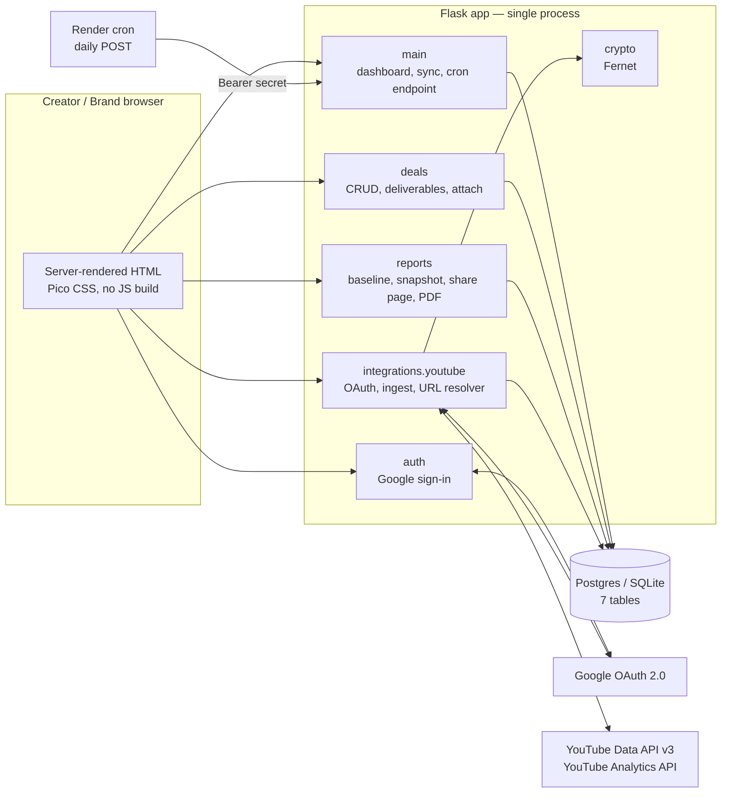
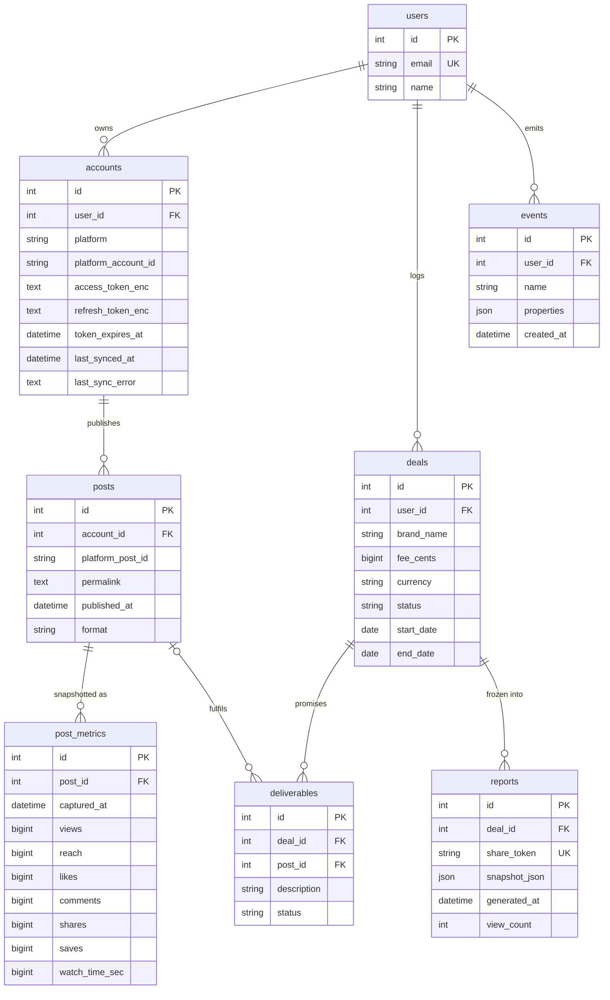

# Deal Desk — System Design (as built)

Status: describes the code on `main` as of the initial commit. Covers weeks 1–3 of the build plan: Google sign-in, YouTube ingest, deals, baseline, shareable reports. Instagram, the media kit and the rate index are not built and are called out in §11 only where the current design makes room for them.

---

## 1. Scope and design goals

**What the system does.** A creator connects a YouTube channel, logs a brand deal, attaches the videos that fulfilled it, and generates a frozen, shareable performance report the brand can open without an account.

**Design goals, in priority order:**

1. **Trustworthy numbers.** Every figure in a report traces to the platform's official API and a stated, testable baseline. A report never changes after it's generated.
2. **Creator credentials are safe.** OAuth tokens are encrypted at rest and never logged or rendered.
3. **Boring infrastructure.** One Flask process, one database, one cron. No queue, no worker fleet, no build step. A solo engineer can operate it.
4. **Platform-agnostic core.** The deal/report layer doesn't know what YouTube is. Adding Instagram touches one integration module and one resolver branch.

**Explicit non-goals for this stage:** real-time metrics, multi-user accounts/agencies, auto-matching posts to deliverables, any predictive modelling.

---

## 2. Architecture overview



**Runtime shape:** one WSGI process (gunicorn on Render), one database, one external cron hitting an HTTP endpoint. There is no background worker; ingest runs inline in the request that triggers it (connect callback, "Sync now", or the cron call). This is acceptable at design-partner scale (≤ 200 videos per channel, one API round-trip per 50 videos) and is the first thing to change when it isn't — see §11.

---

## 3. Components

| Module | Responsibility | Depends on |
|---|---|---|
| `dealdesk/__init__.py` | App factory. Wires config, DB, migrations, OAuth, blueprints, template filters. | everything |
| `config.py` | Env-driven config. `TestConfig` uses in-memory SQLite and a fixed test key. | — |
| `db.py` | SQLAlchemy 2.x declarative base, Flask-Migrate. | — |
| `models.py` | The seven tables and the `track()` instrumentation helper. | `db` |
| `crypto.py` | `encrypt()`/`decrypt()` for tokens. Fails loudly if the key is missing. | Flask config |
| `auth.py` | Two Authlib clients on one Google app: `google` (identity) and `google_youtube` (data scopes, offline). Session-based login, `login_required`. | `models`, `crypto` |
| `integrations/youtube.py` | Connect callback, token refresh, upload listing, video upsert + metric snapshot, watch-time enrichment, `video_id_from_url()`. | `auth`, `crypto`, `models` |
| `deals.py` | Deal/deliverable CRUD, `resolve_post_url()` — the only place that knows which platform resolver to call. | `models`, `integrations.youtube` |
| `reports.py` | `baseline()`, `build_snapshot()`, report generation, public share page, PDF. | `models` |
| `main.py` | Landing, dashboard, manual sync, `/internal/refresh`. | `integrations.youtube` |

**Dependency rule:** `reports` and `deals` never import a platform API client directly, except for `deals → youtube.video_id_from_url`, which is pure string parsing. The platform boundary is `Account.platform` + the integration module.

---

## 4. Data model



### Decisions and why

| Decision | Alternative rejected | Reason |
|---|---|---|
| **The deal is the primitive.** Everything hangs off `deals`; posts are attached to it via `deliverables`. | Post-centric model with deals as tags | The product's value is the contract, not the content. It also makes the product useful on day one with zero post history. |
| **Wide `post_metrics`, one row per snapshot.** | `metric_name / value` long (EAV) table | Eight known metrics, not eight hundred. Wide rows make every report query a plain `SELECT`; EAV makes every one a pivot. |
| **Append-only snapshots.** `posts` holds identity; `post_metrics` holds measurements over time. `Post.latest_metrics` is the last row. | Overwrite current values on each sync | Performance-over-time comes for free, and a report can always cite exactly which capture it used. Storage cost is trivial (≈ 60 bytes × posts × syncs). |
| **`reports.snapshot_json` is denormalised and frozen.** The share page renders only from it. | Render reports live from `posts`/`post_metrics` | A report sent to a brand must show the same numbers next month. Also decouples the report page from every future schema change. |
| **Money in integer cents + 3-letter currency.** | Float / Decimal | No rounding drift; currency is data, not a global. |
| **`format` normalised across platforms** (`video`, `short`, `reel`, `image`, `carousel`, `story`). | Per-platform type strings | The baseline compares like with like; "short" and "reel" are already the same shape of content and can be grouped later. |
| **Unique `(platform, platform_account_id)` on `accounts`.** | Per-user uniqueness | One channel cannot be claimed by two Deal Desk users; the callback refuses the second. |
| **`events` table over a third-party analytics SDK.** | Segment/PostHog | Zero cost, in the same transaction as the action, queryable with SQL. Swap later if needed. |

---

## 5. Key flows

### 5.1 Sign-in

```mermaid
sequenceDiagram
    participant B as Browser
    participant A as auth blueprint
    participant G as Google
    participant DB
    B->>A: GET /auth/login
    A->>G: authorize_redirect (scope: openid email profile)
    G-->>B: consent → redirect
    B->>A: GET /auth/google/callback?code
    A->>G: exchange code → id_token + userinfo
    A->>DB: upsert User by email; track(user_signed_up)
    A-->>B: session[user_id]=…; 302 /dashboard
```

Identity only. No data scopes are requested at sign-in, so the consent screen is minimal and a user who never connects YouTube never grants it.

### 5.2 Connect YouTube and initial ingest

```mermaid
sequenceDiagram
    participant B as Browser
    participant Y as youtube blueprint
    participant G as Google OAuth
    participant D as YouTube Data API
    participant AN as YouTube Analytics
    participant DB
    B->>Y: GET /connect/youtube
    Y->>G: authorize_redirect (youtube.readonly, yt-analytics.readonly, access_type=offline, prompt=consent)
    G-->>B: consent → redirect
    B->>Y: GET /connect/youtube/callback?code
    Y->>G: exchange → access_token, refresh_token, expires_in
    Y->>D: channels.list?mine=true
    Y->>DB: upsert Account (tokens encrypted); track(account_connected); COMMIT
    Y->>Y: sync_account()
    Y->>D: channels.list → uploads playlist id
    loop up to 200 ids, 50/page
        Y->>D: playlistItems.list
    end
    loop 50 ids per call
        Y->>D: videos.list (snippet, statistics, contentDetails)
        Y->>DB: upsert Post; append PostMetric
    end
    Y->>AN: reports (estimatedMinutesWatched by video) — best effort
    Y->>DB: fill watch_time_sec on latest snapshots; last_synced_at; COMMIT
    Y-->>B: flash + 302 /dashboard
```

Two commits on purpose: the account is persisted **before** the first sync so a failed sync leaves a connected account with `last_sync_error` set rather than an orphaned consent.

`prompt=consent` forces Google to return a `refresh_token` every time; without it, a re-connect returns only an access token and the account silently dies in an hour. The callback stores the refresh token only when present so a reconnect never overwrites a good one with `None`.

### 5.3 Attach a post to a deliverable

```
POST /deals/<id>/deliverables/<d_id>/attach   url=<pasted link>
  → resolve_post_url(user_id, url)
      → video_id_from_url(url)           # pure parser, 9 URL shapes
      → SELECT post WHERE platform_post_id=? AND account_id IN (user's accounts)
  → found:   deliverable.post_id=…, status='delivered', track(deliverable_attached)
  → missing: flash a diagnostic ("is the account connected, has it synced?"), status unchanged
```

Manual by design. The ownership constraint (`account_id IN user's accounts`) means a creator can only attach their own content, even if they paste someone else's link.

### 5.4 Generate and share a report

```mermaid
sequenceDiagram
    participant C as Creator
    participant R as reports blueprint
    participant DB
    participant Br as Brand (anonymous)
    C->>R: POST /deals/<id>/reports
    R->>DB: load Deal + deliverables + posts + latest metrics
    R->>R: build_snapshot(): per post → baseline(), lift; totals, CPM, CPE
    R->>DB: INSERT Report(share_token, snapshot_json); track(report_generated)
    R-->>C: 302 /r/<token>  (owner bar: link, PDF, view count)
    Br->>R: GET /r/<token>
    R->>DB: SELECT report by token; view_count += 1; track(report_viewed)
    R-->>Br: render report.html from snapshot_json only
```

`share_token` is 24 random bytes, URL-safe (≈ 143 bits). Unguessable is the access control; there is no login on the share page and the page carries `noindex`. Owner views don't increment `view_count`, so the count means "brand-side opens."

### 5.5 Scheduled refresh

```
cron (daily) → POST /internal/refresh  Authorization: Bearer <INTERNAL_REFRESH_TOKEN>
  for each Account:
      try sync_account(account)  → new PostMetric rows, last_synced_at
      except → log, last_sync_error, continue        # one bad account never stops the batch
  → JSON summary per account
```

Token refresh is lazy inside `_fresh_access_token()`: if the stored access token expires within two minutes, exchange the refresh token first. A missing refresh token raises a clear "needs to reconnect" error that lands in `last_sync_error` and is shown on the dashboard.

---

## 6. The baseline — specification

This is the number every claim in a report rests on. It's specified here so it can be argued with.

```
baseline(account_id, format, as_of, window=20) →
    { views: median, engagements: median, n: int, window: int }

Population:
    posts on the same account
    AND same normalised format
    AND published_at < as_of              # strictly before the sponsored post
    AND id NOT IN (SELECT post_id FROM deliverables WHERE post_id IS NOT NULL)   # organic only
    ORDER BY published_at DESC LIMIT window

Value per post: latest snapshot (views; engagements = likes+comments+shares+saves, nulls as 0)
Aggregate: statistics.median
Empty population: all None, n = 0 — never a substituted number
```

**Properties guaranteed by tests** (`tests/test_baseline_and_report.py`):

- Other formats don't contaminate (a viral short doesn't move a video's baseline).
- Sponsored posts are excluded — including *this* sponsored post, and any other deal's posts.
- Posts published after `as_of` don't leak backwards; a report's baseline is stable as new organic content is published.
- Median, not mean: one outlier doesn't define "normal."

**Known limitations** (documented in the report footer as methodology):

- "Organic" is defined as "not attached to a deal *in Deal Desk*." Historical sponsored posts the creator never logged count as organic and pull the baseline up, understating lift. This is conservative in the brand's favour, which is the right direction to be wrong.
- Snapshot age varies with sync cadence: a 3-day-old sponsored post is compared to organic posts that have had months to accumulate views. Age-normalised baselines (views at day N) are a natural next step once snapshots accumulate — the append-only metrics table already holds the data for it.

---

## 7. Security model

| Concern | Mechanism |
|---|---|
| OAuth tokens at rest | Fernet (AES-128-CBC + HMAC) via `crypto.py`; key from env. Tokens are decrypted only inside the integration module, never returned to templates or logs. Missing key → hard failure at first use, not silent plaintext. |
| Session | Flask signed cookie holding `user_id`. `SECRET_KEY` from env. |
| Object ownership | Every deal/deliverable/account route loads the object and checks `user_id == g.user.id`, returning 404 (not 403) so existence isn't leaked. |
| Report sharing | Capability URL: 143-bit random token. No enumeration endpoint. `noindex`. |
| Cron endpoint | Constant shared secret in `Authorization: Bearer`. Rejects if the secret is unset. |
| Cross-user account claim | DB unique constraint on `(platform, platform_account_id)`; callback refuses to reassign. |
| Secrets in repo | `.env` gitignored; `.env.example` documents keys without values. Test key in `TestConfig` is for the in-memory test DB only. |
| CSRF | **Not implemented.** All mutating routes are POST with session auth; a CSRF token is the first hardening item before non-partner users. |

---

## 8. Failure modes

| Failure | Behaviour |
|---|---|
| YouTube API error mid-sync | `sync_account` rolls back the in-flight transaction, writes `last_sync_error` in a fresh one, re-raises. Dashboard shows the error under the account. Previously written snapshots are intact. |
| Analytics API unavailable (common: scope not yet approved) | Logged as a warning; sync succeeds without `watch_time_sec`. |
| Refresh token missing/revoked | Sync fails with an explicit "reconnect" message; cron continues to the next account. |
| Initial sync fails during connect | Account is already committed; user sees "Connected, but the first import failed" and can hit *Sync now*. |
| Pasted URL doesn't match | Friendly flash with the two likely causes; no state change. |
| WeasyPrint not installed (Windows dev) | `/r/<token>.pdf` returns 503; HTML report unaffected. |
| Report generated with zero attached posts | UI prevents it (button hidden); route would produce a snapshot with `total_views = 0` and `cpm = None` rather than dividing by zero. |
| Baseline population empty | Report shows "n/a" for lift with the count, never a fabricated comparison. |

---

## 9. Instrumentation

All events go to the `events` table inside the same transaction as the action they describe.

| Event | Fired when | Why it matters |
|---|---|---|
| `user_signed_up` | first Google sign-in | top of funnel |
| `account_connected` | YouTube callback succeeds | onboarding step 1 |
| `deal_logged` | deal created (with `fee_cents`, `currency`) | onboarding step 2; also seeds the rate index later |
| `deliverable_attached` | post attached | onboarding step 3 |
| `report_generated` | report created | onboarding step 4 |
| `report_viewed` | anonymous open of a share link | **activation** — the only event that proves the product reached a brand |

Time from `user_signed_up` → first `report_viewed` is the number to watch.

---

## 10. Deployment

```
Render web service ─ gunicorn run:app ─┐
                                        ├── Neon / Supabase Postgres (DATABASE_URL)
Render cron (daily) ─ curl POST /internal/refresh ┘

Env: SECRET_KEY, TOKEN_ENCRYPTION_KEY, GOOGLE_CLIENT_ID/SECRET, DATABASE_URL, INTERNAL_REFRESH_TOKEN
Migrations: `flask --app run db upgrade` as a release command.
```

Local development is identical with `DATABASE_URL=sqlite:///dealdesk.db` and no cron. There is no environment-specific code path; SQLite vs. Postgres is the only difference, and the schema uses nothing Postgres-specific yet (the `JSON` columns are portable).

---

## 11. Extension points and known limits

**Instagram (next).** Requires: a new `integrations/instagram.py` with its own OAuth + ingest writing `Account(platform='instagram')` and `Post(format in reel|image|carousel|story)`; a branch in `resolve_post_url()` for `instagram.com/p/…` and `/reel/…`; a case in `main._sync()`. Nothing in `deals`, `reports`, or the templates changes — the report already renders `platform` and `format` from the snapshot.

**Media kit.** A second public page reading from `accounts` + recent `post_metrics` + delivered deals. Needs one new share token on `users`. No schema change beyond that.

**Rate index.** Everything it needs is already captured: `deals.fee_cents/currency`, `deliverables` count and format, `accounts.follower_count`, engagement from snapshots. It's a query and a model over existing tables plus a ToS clause.

**Age-normalised baselines.** `post_metrics` snapshots already support "views at day 7"; today's baseline uses the latest snapshot only.

**Scaling limits of the current shape.**
- Inline sync blocks the request. Past ~50 connected accounts or channels with thousands of uploads, move `sync_account` behind a job (RQ or a Render background worker) and make the cron enqueue rather than execute.
- `MAX_VIDEOS = 200` backfill. Older sponsored posts can't be attached until this is raised or made incremental.
- `Post.latest_metrics` loads all snapshots to take the last one. Fine at daily cadence for a year (≈ 365 rows per post); replace with a correlated subquery or a `latest_metric_id` column before it isn't.
- No CSRF, no rate limiting, no multi-user accounts. All three precede any non-partner launch.

---

## 12. Testing strategy

- **Unit:** URL parsing and ISO-8601 duration parsing (pure functions, parametrised).
- **Integration (in-memory SQLite, Flask test client):** baseline semantics, snapshot arithmetic, report freezing, ownership/404s, deal creation and attach flow, cron auth.
- **Excluded by design:** Google OAuth, YouTube API calls, PDF rendering. These are verified manually against a real channel; mocking them would test the mock.
- **Auth bypass in tests:** `session["user_id"]` is set directly. No test touches the network.

23 tests, < 1 s. Run with `.venv\Scripts\python -m pytest`.
